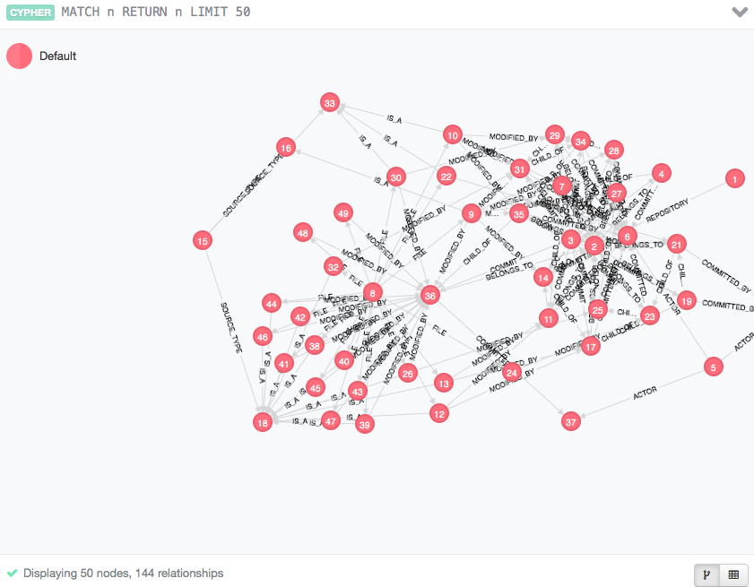
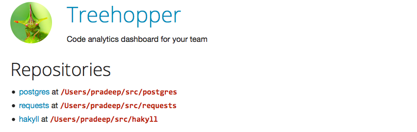
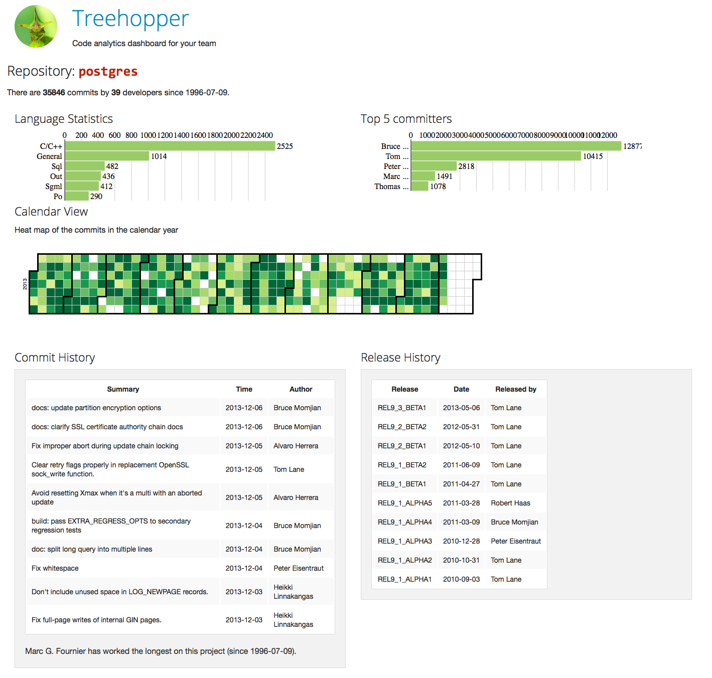

% Treehopper -- exploring version controlled software code bases using
 graph databases
% Pradeep Gowda and Mehmet Kilicarslan
% December 9, 2013

# Introduction

A typical software project has hundreds of files, developed over months
and years by numerous developers. Version control systems are an
integral part of a software development practice. Version control
systems not just important for maintaining the history of a project,
they are also the foundation for a team to collaborate.

Version contolled  code bases contain more than just the history of
individual files, they are also a important artefacts in the archeology
of software development.

There are many ways to visualise source code. Module dependency graphs
are one of them. Dependency graphs for Object oriented programming
languages have classes as the nodes and edges show the dependency
between the class and where it is being used. However, there is lot of
understanding captured outside the source code. Development teams have

# Approach

## Design considerations

## Technology choice

### Database

#### Neo4j

#### Cypher Query Langauge

### Backend

#### Python

Git-Python

#### Django

### Front end

Zurb Foundation

## Usage

### Installing Neo4j database

Download the Neo4j database from the website -- [http://www.neo4j.org]
and unzip (into, say `$NEO4JPATH`)
and start the server using the command line interface

    $ cd NEO4JPATH
    $ bin/neo4j start

You can open [http://localhost:7474/](http://localhost:7474) in the
browser to see the web interface of the database server.

### Installing the treehopper application

There are two parts to the application.

  * Data loader -- a command line interface
  * Dashboard -- a web interface

### Loading repository data

Using the command line interface, the user can parse the git repository
and upload the commit, user, tag, and file information to the graph
database.

The CLI invokation is:

~~~~{.bash}
python manage.py load_git --url /Users/pradeep/src/requests --name requests
~~~~

### Visualising graph nodes

### Analytical dashboard

Front page of the applications where we can see all the repositories
known to the application

### Repository view

Each repository known to the Application shows a dashboard like this:

# Results

# Conclusion

# Future work

  * Support other distributed version control systems like `mercurial`.
  * Handle more than one branch
