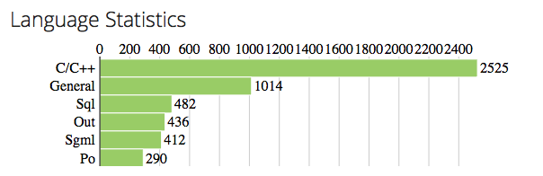

% Treehopper -- exploring version controlled software code bases using
 Neo4j graph database
% Pradeep Gowda and Mehmet Kilicarslan
% December 9, 2013

# Introduction

A typical software project has hundreds of files, developed over months
and years by numerous developers. Version control systems are an
integral part of a software development practice. Version control
systems are not just important for maintaining the history of a project,
they are also the foundation for a team to collaborate.

There are many ways to visualise source code. Module dependency graphs
are one of them. Dependency graphs for Object oriented programming
languages have classes as the nodes and edges show the dependency
between the class and where it is being used. However, there is lot of
understanding captured outside the individual source files.

We wanted to explore the codebases interactively and answer some
interesting questions like:

* Who has worked on this project for the longest time?
* What is the activity level on this project? Has there been an uptick
  in code commits recently?
* What is the "bus factor" on this project? That is, if one or more developers
  leave the team, what will be the impact?
* What is the nature of source code? Eg: what percentage is C files,
  HTML files etc.,

We developed a software that helps us find answers to these
kind of questions on a "on-demand" basis and present it as a visual
dashboard.

# Approach

We selected `git` distributed version control system as the basis for
analyzing codebases. Git was developed by Linus Torvals (the developer of
Linux Operating System) as an answer to the problem of having to
coordinate the work of developers worldwide that goes into to continued
development of Linux Kernel. Git has become the most popular of the open source
distributed version control systems among it's peers, such as
`mercurial`, `bazaar`, `darcs`, `fossil` etc., A large number of open
source projects now use git for distributed version control. Enterprises
often have their own setups of git that compliments their development
practices.

Figure 1 shows a snapshot of the postgresql database's source
code.

The various coloured lines represent the various branches

The description corresponds to a commit, which inturn is a SHA1 hash
guaranteed to be unique. Each commit has a committer. Sometimes the
author of a change is different than the person who commits
it to the repository.

The bottom two windows show the detailed commit log and the `diff`
between the current commit and it's parent commit.

## Git version control system

Every git directory maintains the complete history of changes made to
the files. Git stores these changes in an internal representation called
the git object storage. This storage is a directed acyclic graph.

Files in a code repository are represented by `blob` (though blobs can
point to other things like symbolic links).

Directories are represented by `trees`. The trees refer to `blobs`.

A commit refers to a `tree` that represents the state of the files at
the time of commit.

`refs`: References/heads/branches are bookmarks that point to a node in
the DAG. They serve as reminders to the developers as to  where they are
working at the moment. The `HEAD` ref is a special ref that points to
the currently active branch.

The following graph shows the relation between `blob`, `tree`, `refs`
etc.,

## Design considerations

The realization that git's internal  representation is a graph, made us
consider a graph database to store the repository information. Graph
databases provide an easy way to reason, store and query data.

## Technology choice

### Neo4j graph database

We chose Neo4j as it is the most popular of the modern, open source
Graph databases. It also had good documentation in the form of this
book - [http://graphdatabases.com/](http://graphdatabases.com/) written
by the core authors of the Neo4j database.

Neo4j uses "Cypher" graph querying language that allows for expressive
and efficient querying of graph datastore without having to write
traversals through the graph structures in code. Most of the keywords
like `WHERE` and `ORDER BY` in Cypher are inspired by `SQL`.

The query language is comprised of several distinct clauses.

  * `START`: Starting points in the graph, obtained via index lookups or by element IDs.
  * `MATCH`: The graph pattern to match, bound to the starting points in START.
  * `WHERE`: Filtering criteria.
  * `RETURN`: What to return.
  * `CREATE`: Creates nodes and relationships.
  * `DELETE`: Removes nodes, relationships and properties.
  * `SET`: Set values to properties.
  * `FOREACH`: Performs updating actions once per element in a list.
  * `WITH`: Divides a query into multiple, distinct parts.

### Application backend

We used the Python programming language for developing the backend of
our application. Python is a mature programming language with libraries
and bindings available for all the different parts of the application we
wanted to develop.

We used  Git Python -- http://pythonhosted.org/GitPython/0.3.2/ for
reading the object datastore of a git repository. The release version
was missing an important patch required for handling cryptographically
signed commits. To fix the signed `gpg` commit errors, we used
[this codebase - (https://github.com/sugi/GitPython/tree/gpg-sig-support)](https://github.com/sugi/GitPython/tree/gpg-sig-support)
which has the patches required, but isn't merged with the main
gitpython repository yet.

The web application was developed using the
[Django](https://www.djangoproject.com/) web framework. Django is a MVC
framework that seperates application logic, presentation, and URL
routing. Django also has a prolific amount of functionality out of the
box and extensive collection of libraries that add functionality.

We chose Django because of our previous experience in using Django for
commercial application development.

### Web interface -- frontend

An important part of modern web application development is the need to
have easy to use, accessible (from various devices - desktop, laptop,
mobile and tablets) and attractive interfaces. Accomodating all these
variables is a daunting task. Many HTML+CSS frameworks have been written
to address these issues. Some of the more popular ones are: `Bootstrap`
from Twitter, `Foundation` by Zurb, `YUI` by Yahoo.

We chose Zurb, even though we had previous experience with bootstrap
because the project presented an opportunity to try a new framework.

Zurb provided layout elements (grids, rows), visual styling elements
(automatic content rearrangement based on device display parameters).

### Visualization

A picture can convey a large amount of information succinctly. We made
use of the excellent [D3.js](http://d3js.org) library to create the
charts used in the application. D3.js has been used to create
visualization for various high profile projects including nytimes.com.

## Installation and Usage

The application is named `thweb` and all the related files are in the
`thweb` directory.

### Installing Neo4j database

Download the Neo4j database from the website -- [http://www.neo4j.org]
and unzip (into, say `$NEO4JPATH`)
and start the server using the command line interface

    $ cd NEO4JPATH
    $ bin/neo4j start

The user can open [http://localhost:7474/](http://localhost:7474) in the
browser to see the web interface of the database server.

### Installing the treehopper application

The user will need the following python libraries. We recommend using a
python `virtualenv` to isolate these library installations.

  * Django
  * Neomodel
  * Gitpython

The user can use the `requirements.txt` to install all the dependencies
to the virtual environment using this command:

~~~~{.bash}
    $ workon thdev
    $ #where thdev is the name of the virtualenvironment
    $ pip install -r requirements.txt
~~~~

### Using the treehopper application

There are two parts to the application.

  * Data loader -- a command line interface
  * Dashboard -- a web interface

### Loading repository data

Using the command line interface, the user can parse the git repository
and upload the commit, user, tag, and file information to the graph
database.

The CLI invokation is:

~~~~{.bash}
cd $THWEB
python manage.py load_git --url /Users/pradeep/src/requests --name requests
~~~~

where, `/Users/pradeep/src/requests` contains a git repository. The
`--name` parameter is optional.

### Running the web application

~~~~{.bash}
cd $THWEB
python manage.py runserver
Validating models...

0 errors found
December 09, 2013 - 13:50:24
Django version 1.6, using settings 'thweb.settings'
Starting development server at http://127.0.0.1:8000/
Quit the server with CONTROL-C.
~~~~

This will start the Django server on port `8000` of `localhost`.

### Visualising graph nodes

Once the user has the repository data loaded into the graph database, you
can use the built-in data browser and query interface.

The data browser allows the user to visualise the datbase using canned
queries.

The user can also write queries in `CYPHER` language.

In the above figure, 50 random nodes are returned by the datastore using
the query:

    MATCH n RETURN n LIMIT 50

# Design

We modeled the graph database close the object representation of the
git repository.

The above shows a property graph model of our application.

A *property graph* is made of *nodes*, *relationships*, and
*properties*.

* Nodes contain *properties*. Nodes can be thought of as documents that
  store properties in the form of key-value pairs. The keys are strings
  and values are arbitarary data types.

* Relationships connect the nodes. A relationship has a direction, a
  label, a *start node* and an *end node*.

* Relationships can also have properties. These properties are useful in
providing additional metadata for graph algorithms, adding semantics to
relationships and constraing queries at runtime.

## Nodes

### Repository

Property  Description
--------  -----------
name      name given to the repository by the application administrator
url       path to the local checkout of the repository

This is a top level node. All commits belong to a one and only repository.

### Commit

Property  Description
--------  -----------
hexsha    40 byte hex version of the 20 byte bin sha that uniquely identifies a commit
message   Commit message. It may be an empty string if no message is provided.
summary   The first line of the commit message.
ctime     commit time in unix timestamp format
date      commit date in `yyyy-mm-dd` format
tag       if the commit was tagged, this will hold the tag string

This node is central to the application. This contains the unique
identifier (`hexsha`) unique to each commit.

### Committer

Property   Description
--------   -----------
Name       Name of the committer
Email      Email of the committer

This is the information about the developer who has committed one or
more commits to the repository.

### File

Property   Description
--------   -----------
path       relative path to the file from the base of the repository

This node stores information about individual files in the repository.

### SourceType

Property   Description
--------   -----------
name       file type identifier

This Node identifies a the source file type of a file. That is a a file
ending with `.cpp` is `C++` file, `.py` is a Python file. etc.,

## Relationships

\begin{table}[h]
\begin{tabular}{lllll}
 & Relationship  & From & To & Description \\ \hline
 & BELONGS\_TO & Commit & Repository & Every commit belongs to exactly
 one repository \\
 & CHILD\_OF & Commit & Commit & Every commit (except the very first
commit) has one or more parents  \\
 & COMMITTED\_BY  & Commit & Committer & A commit is committed to
 repository by a named committer \\
 & MODIFIED\_BY & File & Commit & Every file in the repository is
 modified by one or more commits \\
 & IS\_A & File & SourceType & every file is of certain file type \\ \hline
\end{tabular}
\end{table}

# Results

## Analytical dashboard

We can see all the repositories
known to the application on the front page of the application.

This view is obtained by querying the database for all the *Repository*
type nodes.

The *NeoModel* library provides an easy to use API for querying all the nodes of
a type. We used this following call to to fetch all the *Repository*
objects and dispatched it to the view template and displayed it as HTML.

~~~{.python}
Repository.category().instance.all()
~~~~

~~~~{.html}
    <h2>Repositories</h2>
    <ul>
    
    <li><a href="/repo/{{repo.name}}">{{repo.name}}</a>
    at <code>{{repo.url}}</code></li>
    
    </ul>
~~~~

## Repository view

Each repository known to the application shows a dashboard like this:

### Summary statistics
At the top of the page, we see the name of the repository.

Below the repository name is a summary statistics of the repository.

The cypher queries used to extract this information are:

Total number of commits in the repository

~~~~{.sql}
START myrepo=node:Repository(name="postgres")
MATCH (commit)-[:BELONGS_TO]->myrepo
WITH commit
WHERE HAS(commit.hexsha)
RETURN count(commit) as total_commits
~~~~

Total number of committers in the repository

~~~~{.sql}
START myrepo=node:Repository(name="postgres")
MATCH (committer)<-[:COMMITTED_BY]-(commit)-[:BELONGS_TO]->myrepo
WITH commit, committer
WHERE HAS(commit.hexsha)
RETURN count(DISTINCT committer.name)
~~~~

### Programming language distribution

An important metric of a code base is the distribution of various
programming langauges. In a modern, large codebase, there are various
types of programming langauges in use. We give a graphical view of the
distribution as shown below

The Cypher query used to extract this information is:

~~~~{.python}
def langpopularity(self):
    "return the number of files of all source file types"
    results = self.cypher("""START myrepo=node({self})
MATCH (a)-[:IS_A]->(b)
WITH a,b
WHERE HAS(a.path)
RETURN DISTINCT b.name, count(b)
ORDER BY count(b) DESC
""")
        return results[0]
~~~~

### Developer contribution

Software development is inherently a people driven activity. We show the
*Top 5 Committers* statistic as a reminder of who has contributed the
most code to the repository. While, just the number of lines committed
by a developer is not a proxy for their competence and contribution, it
is an important metric to know.

The Cypher query used to extract this information is:

~~~~{.python}
def most_commits_by_n_users(self, n=5):
    "return the total commits by n most active users"
    results = self.cypher("""START myrepo=node({self})
MATCH (committer)<-[COMMITTED_BY]-(commit)-[:BELONGS_TO]->myrepo
with commit, committer
WHERE HAS(committer.name)
RETURN DISTINCT committer.name, COUNT(commit)
ORDER BY COUNT(commit) DESC
LIMIT %d
""" % (n, ))
        return results[0]
~~~~

The parameter `n` controls the number of top developers we would like to see.

### Recent activity -- calendar view

The best indicator of an active project is the frequency and recency
with which the source code is being committed to the repository by the
developers. We used the *heat map* method to visualise this
information.

The Cypher query to extract the information is:

~~~~{.python}
def commit_counts_by_day_for_year(self, year):
    "Return commit_counts_by_day_for_year"
    pattern = '%s-.*' % (year, )
    results = self.cypher("""
START myrepo=node({self})
MATCH (c)-[:BELONGS_TO]->(myrepo)
WITH c as c, '%s' as pat
WHERE c.date =~ pat
return c.date as date, count(c) as count""" % (pattern, ))
        return results
~~~~

We have demonstrated that it is possible to extract significant amount
of analysis about the codebase using our application.

# Conclusion

Graph databases are an excellent datastore option for non-traditional
applications like `treehopper`. Graph databases facilitate easy modeling of the
domain under consideration without having to "force" the data into a
traditional Entity-Relationship model.

The biggest advantage we found with graph databases is that, it is quite
easy to write the queries for the graph data as long as we can draw a
connection between the two (or more) nodes that we want to relate. This
is much more easier to reason than a join between tables in an RDBMS.

# Future work

Support other distributed version control systems like `mercurial`.

Handle more than one branch. Branching is used with much more
commonly in git than in version control systems like subversion, where
branching is a much more expensive operation. By adding all the
branches to the repository, we can visualize the process of how features
and bugs are handled using the branching mechanism.

Write queries and create visualizations to see the relation between
various repositories. Often, developers work on more than one code
repository at time. By having all the repositories that belong to an
organization in the `treehopper` system, we can create "user"
dashboards, which can then show developer involvement in various
projects.

# References

  * Git for Computer Scientists -- http://eagain.net/articles/git-for-computer-scientists/

  * Cypher Query Language --
    http://docs.neo4j.org/chunked/stable/cypher-query-lang.html

## Links to software libraries used

  * Django Project -- https://www.djangoproject.com/
  * Neo4J -- http://www.neo4j.org/
  * Git Python -- http://pythonhosted.org/GitPython/0.3.2/index.html
  * Neo2py - http://book.py2neo.org/
  * Neomodel -- https://github.com/robinedwards/neomodel
  * Zurb Foundation -- http://foundation.zurb.com/
  * D3.js -- http://d3js.org/
