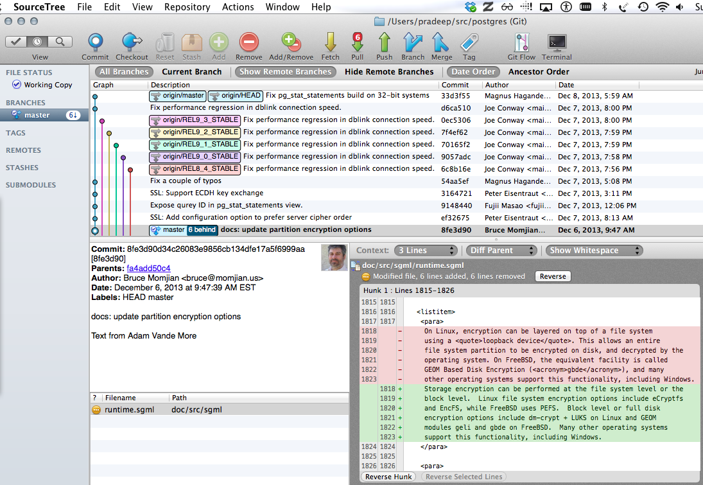

% Treehopper -- exploring version controlled software code bases using
 graph databases
% Pradeep Gowda and Mehmet Kilicarslan
% December 9, 2013

# Introduction

A typical software project has hundreds of files, developed over months
and years by numerous developers. Version control systems are an
integral part of a software development practice. Version control
systems not just important for maintaining the history of a project,
they are also the foundation for a team to collaborate.

Version contolled  code bases contain more than just the history of
individual files, they are also a important artefacts in the archeology
of software development.

There are many ways to visualise source code. Module dependency graphs
are one of them. Dependency graphs for Object oriented programming
languages have classes as the nodes and edges show the dependency
between the class and where it is being used. However, there is lot of
understanding captured outside the source code.

We wanted to explore the codebases interactively and answer some
interesting questions like:

* Who has worked on this project for the longest time?
* What is the activity level on this project? Has there been an uptick
  in code commits recently?
* What is the "bus factor" on this project? That is, if one or more developers
  leave the team, what will be the impact?
* What is the nature of source code? Eg: what percentage is C files,
  HTML files etc.,

We decided on developing a software that let us find answers to these
kind of questions on a "on-demand" basis and present it as a visual
dashboard.

# Approach

We selected `git` distributed version control system as the basis for
analyzing codebases. Git was developed by Linus Torvals (the developer of
Linux Operating System) as an answer to the problem of having to
coordinate the work of developers worldwide that goes into to continued
development of Linux Kernel. Git has become the most popular of the open source
distributed version control systems among it's peers, such as
`mercurial`, `bazaar`, `darcs`, `fossil` etc., A large number of open
source projects now use git for distributed version control. Enterprises
often have their own setups of git that compliments their development
practices.

The above image shows a snapshot of the postgresql database's source
code.

The various coloured lines represent the various branches

The description corresponds to a commit, which inturn is a SHA1 hash
guaranteed to be unique. Each commit has a committer. Sometimes the
author of a change to the files is different than the person who commits
it to the repository.

The bottom two windows show the

## Git version control system

Every git directory maintains the complete history of changes made to
the files. Git stores these changes in an internal representation called
the git object storage. This storage is a directed acyclic graph.

Files in a code repository are represented by `blob` (though blobs can
point to other things like symbolic links).

Directories are represented by `trees`. The trees refer to `blobs`.

A commit refers to a `tree` that represents the state of the files at
the time of commit.

`refs`: References/heads/branches are bookmarks that point to a node in
the DAG. They serve as reminders to the developers as to  where they are
working at the moment. The `HEAD` ref is a special ref that points to
the currently active branch.

The following graph shows the relation between `blob`, `tree`, `refs`
etc.,

## Design considerations

## Technology choice

### Database

#### Neo4j

#### Cypher Query Langauge

### Backend

#### Python

Git-Python

#### Django

### Front end

Zurb Foundation

## Usage

### Installing Neo4j database

Download the Neo4j database from the website -- [http://www.neo4j.org]
and unzip (into, say `$NEO4JPATH`)
and start the server using the command line interface

    $ cd NEO4JPATH
    $ bin/neo4j start

You can open [http://localhost:7474/](http://localhost:7474) in the
browser to see the web interface of the database server.

### Installing the treehopper application

There are two parts to the application.

  * Data loader -- a command line interface
  * Dashboard -- a web interface

### Loading repository data

Using the command line interface, the user can parse the git repository
and upload the commit, user, tag, and file information to the graph
database.

The CLI invokation is:

~~~~{.bash}
python manage.py load_git --url /Users/pradeep/src/requests --name requests
~~~~

### Visualising graph nodes

### Analytical dashboard

Front page of the applications where we can see all the repositories
known to the application

### Repository view

Each repository known to the Application shows a dashboard like this:

# Results

# Conclusion

# Future work

  * Support other distributed version control systems like `mercurial`.
  * Handle more than one branch

# Reference

- [Git for Computer Scientists](http://eagain.net/articles/git-for-computer-scientists/)
